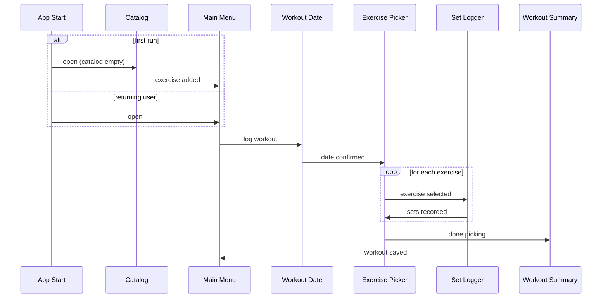

# Fitness Tracker

A keyboard-driven terminal application for logging workouts — built with Rust and a local SQLite database. No accounts, no cloud, no internet connection required.

## Overview

Fitness Tracker lets you maintain a personal catalog of exercises organised by muscle group, then log daily workouts by selecting exercises from that catalog and recording each set with its rep count and weight.

All data is stored locally in a single SQLite file on your machine. The application runs entirely inside your terminal — no GUI, no browser.

The app's written in Rust using [ratatui](https://github.com/ratatui-org/ratatui) for the TUI and [rusqlite](https://github.com/rusqlite/rusqlite) (bundled SQLite) for persistence. UUID v4 primary keys throughout. Cross-platform: macOS, Linux, and Windows.

---

## Setting Up

### Prerequisites

You need a working **Rust toolchain** and a **C compiler** (bundled SQLite compiles C at build time).

#### Rust

```bash
curl --proto '=https' --tlsv1.2 -sSf https://sh.rustup.rs | sh
```

Windows: download the installer from [rustup.rs](https://rustup.rs).

#### C Compiler

| Platform | What you need |
|---|---|
| macOS | Xcode Command Line Tools — run `xcode-select --install` |
| Linux | `gcc` and `make` — `sudo apt install build-essential` (Debian/Ubuntu) or equivalent |
| Windows | [Visual Studio Build Tools](https://visualstudio.microsoft.com/visual-cpp-build-tools/) — select **Desktop development with C++**, or use MinGW-w64 |

### Build

```bash
git clone <repository-url>
cd fitness-tracker
cargo build --release
```

Binary location after build:

| Platform | Path |
|---|---|
| macOS / Linux | `target/release/fitness-tracker` |
| Windows | `target\release\fitness-tracker.exe` |

### Run

```bash
# macOS / Linux
./target/release/fitness-tracker

# Windows
.\target\release\fitness-tracker.exe

# Or via Cargo (unoptimised dev build)
cargo run
```

No additional installation steps are needed. The SQLite database is created automatically on first run.

---

## The Application

### First Launch

On first run the **Catalog** screen opens automatically. Add at least one exercise before logging a workout. Thirteen muscle-group categories come pre-seeded:

> Back · Biceps · Calves · Cardio · Chest · Core/Abs · Forearms · Full Body · Glutes · Legs (Hamstrings) · Legs (Quads) · Shoulders · Triceps

Once the catalog has at least one exercise, the **Main Menu** is shown on all subsequent launches.

### Screen Flow



### Keyboard Shortcuts

All navigation is keyboard-only.

#### Catalog

| Key | Action |
|---|---|
| `↑` `↓` | Navigate exercise list |
| `a` | Add a new exercise |
| `f` | Cycle category filter (All → Back → Biceps → … → All) |
| `d` | Delete selected exercise (press once to arm, once more to confirm) |
| `Enter` | Go to Main Menu |
| `q` | Quit |

#### Add Exercise

| Key | Action |
|---|---|
| `Tab` / `Shift-Tab` | Switch between Name input and Category list |
| `↑` `↓` | Move through category list (when Category focused) |
| `Backspace` | Delete a character in the Name field |
| `Enter` | Save and return to Catalog |
| `Esc` | Cancel and return to Catalog |

#### Main Menu

| Key | Action |
|---|---|
| `l` | Log a workout |
| `c` | Manage the exercise catalog |
| `q` | Quit |

#### Workout Date

| Key | Action |
|---|---|
| `Backspace` | Delete a character |
| `Enter` | Confirm date — format must be `YYYY-MM-DD` |
| `Esc` | Back to Main Menu |

The field is pre-filled with today's date. Edit it to log a workout for a different day.

#### Exercise Picker

| Key | Action |
|---|---|
| `↑` `↓` | Navigate exercise list |
| `f` | Cycle category filter |
| `Enter` | Select highlighted exercise → Set Logger |
| `d` | Done picking — go to Workout Summary |
| `Esc` | Back to Workout Date |

Exercises already added in this session are marked `✓`.

#### Set Logger

| Key | Action |
|---|---|
| `Tab` | Switch focus between **Reps** and **Weight** inputs |
| `0–9` | Enter digits (Weight also accepts `.` for decimals) |
| `Backspace` | Delete a character |
| `Enter` | Record the current set |
| `d` | Done with this exercise — back to Exercise Picker |
| `Esc` | Discard this exercise — back to Exercise Picker |

#### Workout Summary

| Key | Action |
|---|---|
| `s` | Save the session to the database |
| `Esc` | Back to Exercise Picker to add more exercises |

### Data Storage

The database file is created automatically on first run:

| Platform | Path |
|---|---|
| macOS | `~/Library/Application Support/fitness-tracker/data.db` |
| Linux | `~/.local/share/fitness-tracker/data.db` |
| Windows | `%APPDATA%\fitness-tracker\data.db` |

The file is a standard SQLite 3 database. It can be opened with any SQLite client (e.g. [DB Browser for SQLite](https://sqlitebrowser.org)) for inspection, backup, or export.
